See full Reference and Usage Guide at:
https://soul-traveller.github.io/github-traffic-dashboard/

# 📊 GitHub Traffic Dashboard

This dashboard tracks historical traffic data (clones and views) for GitHub repositories.

**Last Updated:** 2026-05-05T04:54:05.154191Z

## 📋 How Metrics Are Calculated

This dashboard uses GitHub Traffic API data to calculate the following metrics:

### 📊 Core Metrics

**Views:**
- Counted when someone visits the repository page
- Includes page views from web browsers
- Does not include visits via command-line tools or APIs

**Clones:**
- Counted when someone clones the repository
- Includes clones via `git clone`, GitHub Desktop, download ZIP, and API
- Can occur without a corresponding view event

**Important:** Views and Clones are **independent metrics**. Users can:
- View without cloning
- Clone without viewing (e.g., via `git clone` command)
- Both view and clone

### 🔢 Calculation Formulas

**For any time period (short-term, medium-term, lifetime):**

**Total Metrics:**
- Total Views = Sum of daily views for the period
- Total Clones = Sum of daily clones for the period

**Unique Metrics:**
- Unique Views = Sum of daily unique views for the period
- Unique Clones = Sum of daily unique clones for the period
  - Note: This sums daily unique counts, which may count the same user on multiple days

**Repeat Metrics:**
- Repeat Views = Total Views - Unique Views
- Repeat Clones = Total Clones - Unique Clones
- Repeat Percentage = (Repeat / Total) × 100

**Example:**
```
If a repository has:
- Total Views: 100
- Unique Views: 20
Then:
- Repeat Views = 100 - 20 = 80
- Repeat Percentage = (80 / 100) × 100 = 80%
```

### 📈 Graph Data Aggregation

**Daily Graphs:**
- Shows raw daily data points
- Each point represents one day's activity

**Weekly Graphs:**
- Aggregates daily data into 7-day periods
- Each point represents the sum of 7 consecutive days

**Bi-Weekly Graphs:**
- Aggregates daily data into 14-day periods
- Each point represents the sum of 14 consecutive days

**Cumulative Graphs:**
- Shows running totals over time
- Each point represents the sum of all previous days plus current day

## 📋 Table of Contents

Quick navigation to repository statistics:

- [Argyll_Printer_Profiler](#argyll-printer-profiler)
- [Argyll_Printer_Profiler_GUI](#argyll-printer-profiler-gui)
- [Toggle_Display_Profile](#toggle-display-profile)
- [rectarg](#rectarg)
- [github-traffic-dashboard](#github-traffic-dashboard)
- [average_ti3s_rgbgeom](#average-ti3s-rgbgeom)
- [read_image_patch_colors](#read-image-patch-colors)

# Argyll_Printer_Profiler

### 🗅️ Clones

*Repository clone statistics showing total and unique clones over different time periods.*

| Period | Total | Unique |
|--------|-------|--------|
| Last 30 Days | 194 | 97 |
| Last 90 Days | 196 | 99 |
| Lifetime | 196 | 99 |

### 📄 Repeat vs New Clones

*Analysis of repository adoption showing repeat clones vs new unique clones.*

*Note: GitHub API does not provide geographical location data for cloners.*

| Period | Total Clones | Unique Clones | Repeat Clones | Repeat % |
|--------|--------------|----------------|----------------|----------|
| Last 30 Days | 194 | 97 | 97 | 50.0% |
| Last 90 Days | 196 | 99 | 97 | 49.5% |
| Lifetime | 196 | 99 | 97 | 49.5% |

### 👀 Views

*Repository view statistics showing total and unique views over different time periods.*

| Period | Total | Unique |
|--------|-------|--------|
| Last 30 Days | 145 | 20 |
| Last 90 Days | 153 | 28 |
| Lifetime | 153 | 28 |

### 📞 Referrers

*Top referrer sources driving traffic to this repository.*

**Total Unique Referrers:** 2

| Referrer | Total Views | Unique Visitors |
|----------|-------------|----------------|
| github.com | 29 | 3 |
| soul-traveller.github.io | 7 | 1 |

### 👥 Repeat vs New Visitors

*Analysis of visitor engagement showing repeat visitors vs new unique visitors.*

*Note: GitHub API does not provide geographical location data for visitors.*

| Period | Total Views | Unique Visitors | Repeat Visitors | Repeat % |
|--------|-------------|-----------------|-----------------|----------|
| Last 30 Days | 145 | 20 | 125 | 86.2% |
| Last 90 Days | 153 | 28 | 125 | 81.7% |
| Lifetime | 153 | 28 | 125 | 81.7% |

### 📈 Traffic Graphs

*Visual representations of traffic trends over different time periods.*

#### Daily Traffic (30 Days)

*Shows daily clones and views trends for the last 30 days. Useful for identifying short-term patterns and recent activity spikes.*

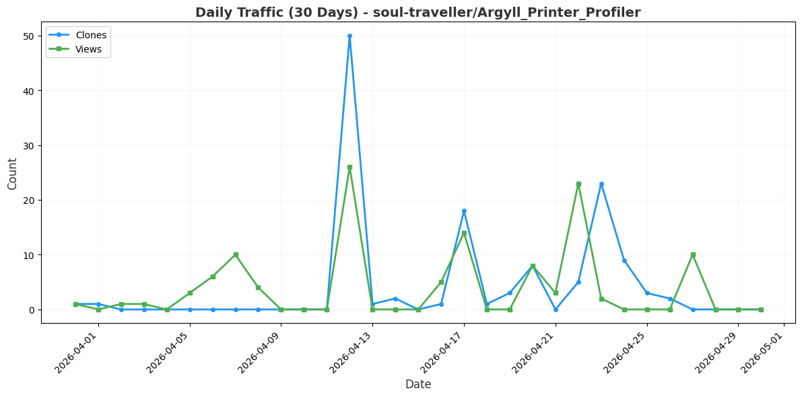

#### Weekly Traffic (12 Weeks)

*Shows weekly aggregated clones and views for the last 12 weeks (~3 months). Useful for identifying medium-term trends and seasonal patterns.*

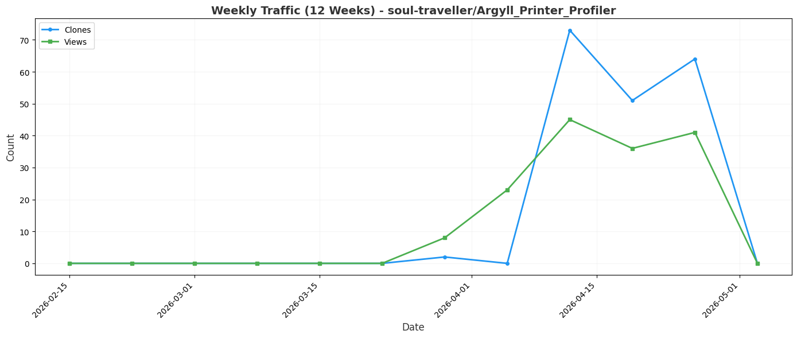

#### Bi-Weekly Traffic (26 Periods)

*Shows bi-weekly aggregated clones and views for the last 26 periods (~1 year). Useful for identifying long-term trends and yearly patterns.*

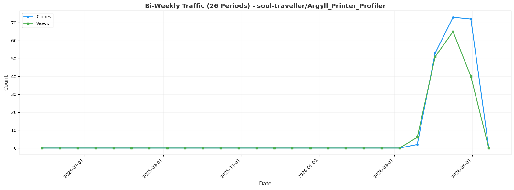

#### Cumulative Traffic (Lifetime)

*Shows running totals of both clones and views over the entire lifetime of tracking. Useful for seeing overall growth and total adoption.*

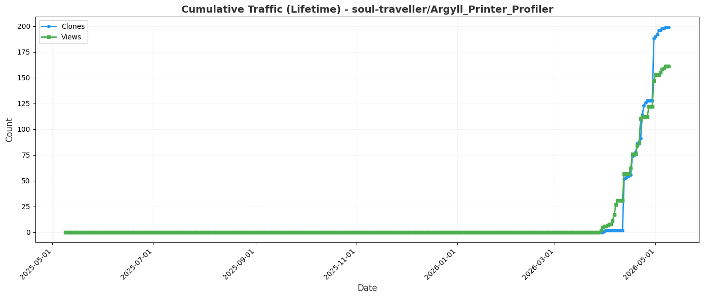

#### Separate Cumulative Graphs

*Individual cumulative graphs for clones and views, allowing for easier comparison between the two metrics.*

**Cumulative Clones:**

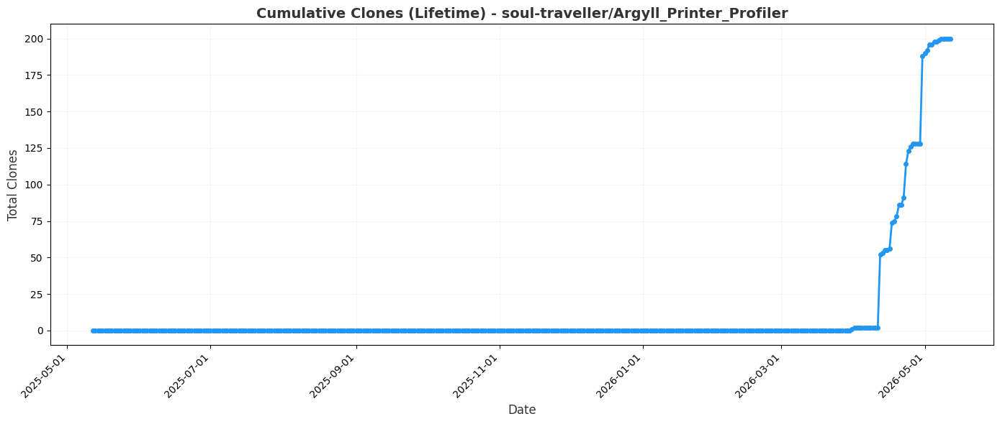

**Cumulative Views:**

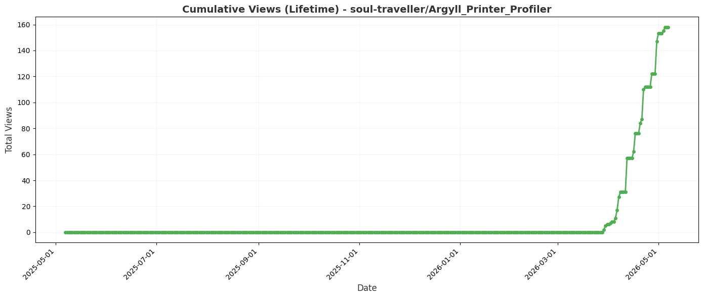

---

# Argyll_Printer_Profiler_GUI

### 🗅️ Clones

*Repository clone statistics showing total and unique clones over different time periods.*

| Period | Total | Unique |
|--------|-------|--------|
| Last 30 Days | 98 | 52 |
| Last 90 Days | 98 | 52 |
| Lifetime | 98 | 52 |

### 📄 Repeat vs New Clones

*Analysis of repository adoption showing repeat clones vs new unique clones.*

*Note: GitHub API does not provide geographical location data for cloners.*

| Period | Total Clones | Unique Clones | Repeat Clones | Repeat % |
|--------|--------------|----------------|----------------|----------|
| Last 30 Days | 98 | 52 | 46 | 46.9% |
| Last 90 Days | 98 | 52 | 46 | 46.9% |
| Lifetime | 98 | 52 | 46 | 46.9% |

### 👀 Views

*Repository view statistics showing total and unique views over different time periods.*

| Period | Total | Unique |
|--------|-------|--------|
| Last 30 Days | 25 | 4 |
| Last 90 Days | 25 | 4 |
| Lifetime | 25 | 4 |

### 📞 Referrers

*Top referrer sources driving traffic to this repository.*

**Total Unique Referrers:** 1

| Referrer | Total Views | Unique Visitors |
|----------|-------------|----------------|
| github.com | 5 | 2 |

### 👥 Repeat vs New Visitors

*Analysis of visitor engagement showing repeat visitors vs new unique visitors.*

*Note: GitHub API does not provide geographical location data for visitors.*

| Period | Total Views | Unique Visitors | Repeat Visitors | Repeat % |
|--------|-------------|-----------------|-----------------|----------|
| Last 30 Days | 25 | 4 | 21 | 84.0% |
| Last 90 Days | 25 | 4 | 21 | 84.0% |
| Lifetime | 25 | 4 | 21 | 84.0% |

### 📈 Traffic Graphs

*Visual representations of traffic trends over different time periods.*

#### Daily Traffic (30 Days)

*Shows daily clones and views trends for the last 30 days. Useful for identifying short-term patterns and recent activity spikes.*

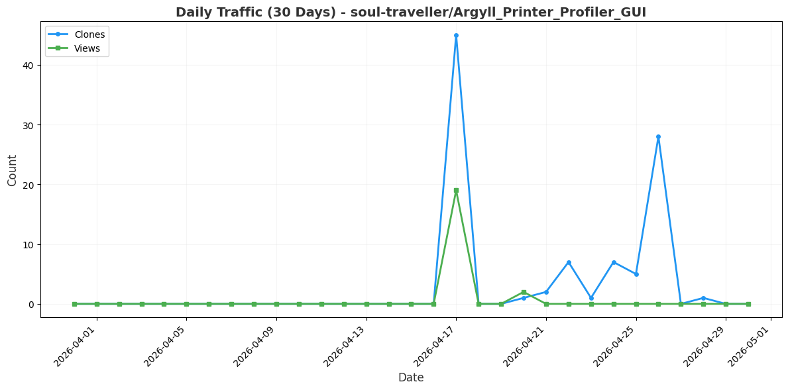

#### Weekly Traffic (12 Weeks)

*Shows weekly aggregated clones and views for the last 12 weeks (~3 months). Useful for identifying medium-term trends and seasonal patterns.*

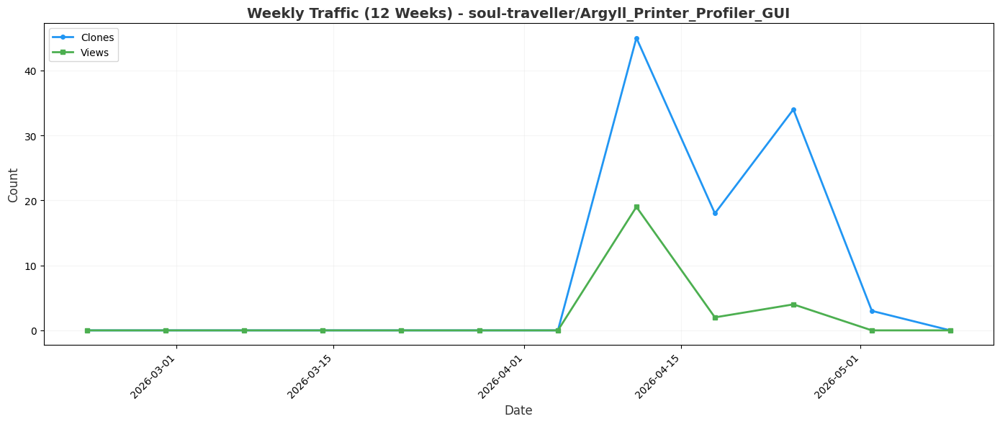

#### Bi-Weekly Traffic (26 Periods)

*Shows bi-weekly aggregated clones and views for the last 26 periods (~1 year). Useful for identifying long-term trends and yearly patterns.*

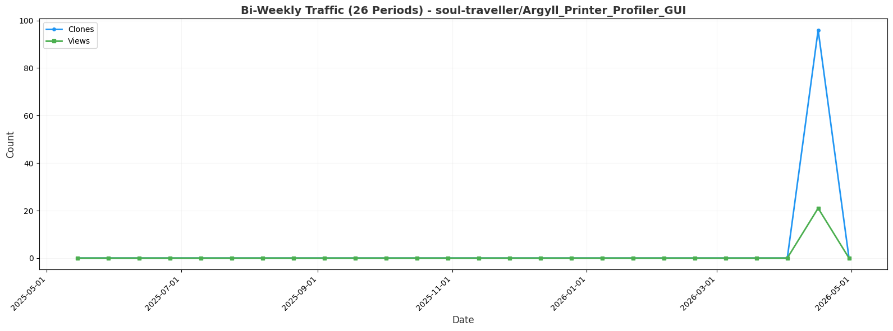

#### Cumulative Traffic (Lifetime)

*Shows running totals of both clones and views over the entire lifetime of tracking. Useful for seeing overall growth and total adoption.*

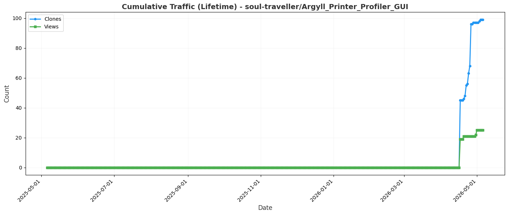

#### Separate Cumulative Graphs

*Individual cumulative graphs for clones and views, allowing for easier comparison between the two metrics.*

**Cumulative Clones:**

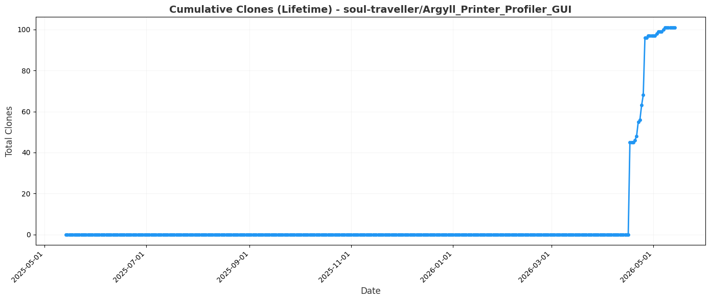

**Cumulative Views:**

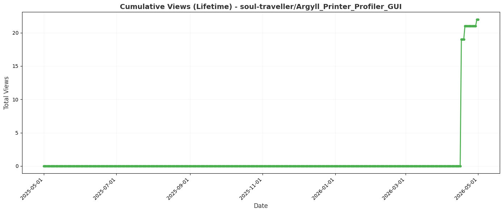

---

# Toggle_Display_Profile

### 🗅️ Clones

*Repository clone statistics showing total and unique clones over different time periods.*

| Period | Total | Unique |
|--------|-------|--------|
| Last 30 Days | 56 | 40 |
| Last 90 Days | 119 | 70 |
| Lifetime | 119 | 70 |

### 📄 Repeat vs New Clones

*Analysis of repository adoption showing repeat clones vs new unique clones.*

*Note: GitHub API does not provide geographical location data for cloners.*

| Period | Total Clones | Unique Clones | Repeat Clones | Repeat % |
|--------|--------------|----------------|----------------|----------|
| Last 30 Days | 56 | 40 | 16 | 28.6% |
| Last 90 Days | 119 | 70 | 49 | 41.2% |
| Lifetime | 119 | 70 | 49 | 41.2% |

### 👀 Views

*Repository view statistics showing total and unique views over different time periods.*

| Period | Total | Unique |
|--------|-------|--------|
| Last 30 Days | 43 | 7 |
| Last 90 Days | 86 | 9 |
| Lifetime | 86 | 9 |

### 📞 Referrers

*Top referrer sources driving traffic to this repository.*

**Total Unique Referrers:** 1

| Referrer | Total Views | Unique Visitors |
|----------|-------------|----------------|
| github.com | 2 | 1 |

### 👥 Repeat vs New Visitors

*Analysis of visitor engagement showing repeat visitors vs new unique visitors.*

*Note: GitHub API does not provide geographical location data for visitors.*

| Period | Total Views | Unique Visitors | Repeat Visitors | Repeat % |
|--------|-------------|-----------------|-----------------|----------|
| Last 30 Days | 43 | 7 | 36 | 83.7% |
| Last 90 Days | 86 | 9 | 77 | 89.5% |
| Lifetime | 86 | 9 | 77 | 89.5% |

### 📈 Traffic Graphs

*Visual representations of traffic trends over different time periods.*

#### Daily Traffic (30 Days)

*Shows daily clones and views trends for the last 30 days. Useful for identifying short-term patterns and recent activity spikes.*

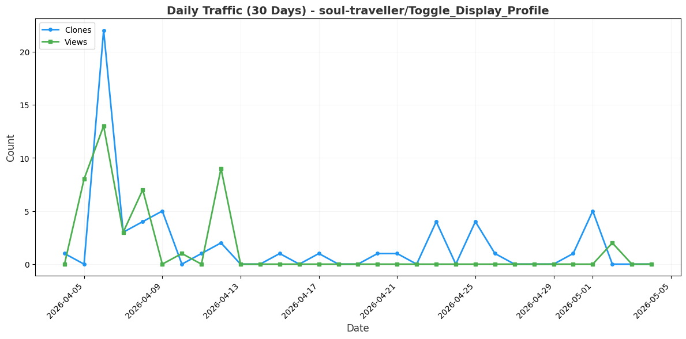

#### Weekly Traffic (12 Weeks)

*Shows weekly aggregated clones and views for the last 12 weeks (~3 months). Useful for identifying medium-term trends and seasonal patterns.*

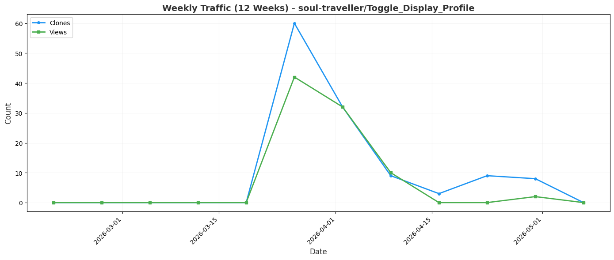

#### Bi-Weekly Traffic (26 Periods)

*Shows bi-weekly aggregated clones and views for the last 26 periods (~1 year). Useful for identifying long-term trends and yearly patterns.*

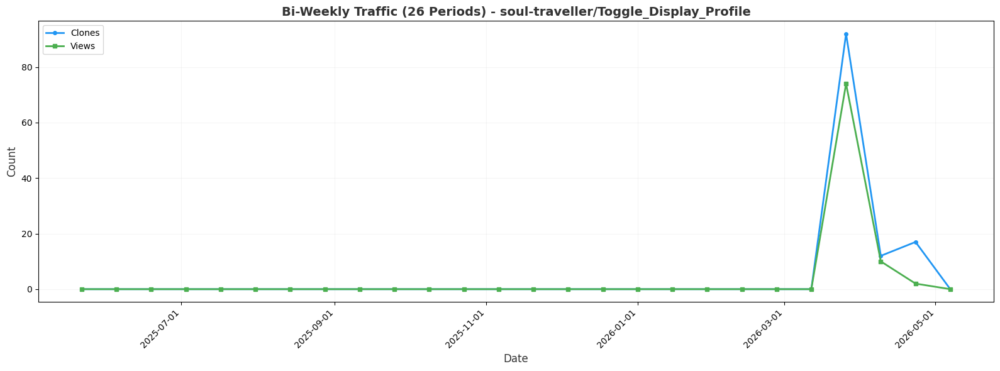

#### Cumulative Traffic (Lifetime)

*Shows running totals of both clones and views over the entire lifetime of tracking. Useful for seeing overall growth and total adoption.*

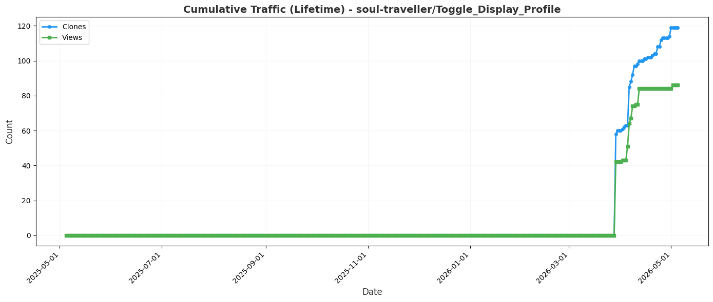

#### Separate Cumulative Graphs

*Individual cumulative graphs for clones and views, allowing for easier comparison between the two metrics.*

**Cumulative Clones:**

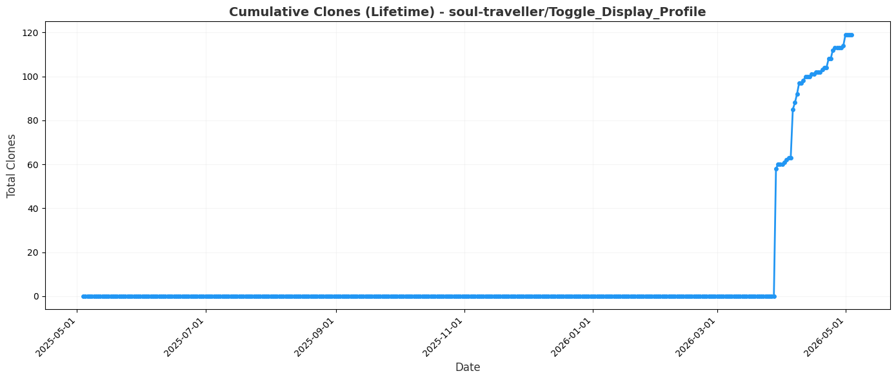

**Cumulative Views:**

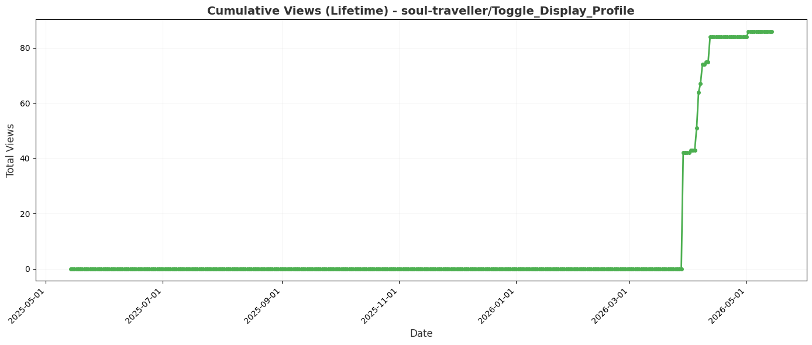

---

# rectarg

### 🗅️ Clones

*Repository clone statistics showing total and unique clones over different time periods.*

| Period | Total | Unique |
|--------|-------|--------|
| Last 30 Days | 66 | 59 |
| Last 90 Days | 69 | 62 |
| Lifetime | 69 | 62 |

### 📄 Repeat vs New Clones

*Analysis of repository adoption showing repeat clones vs new unique clones.*

*Note: GitHub API does not provide geographical location data for cloners.*

| Period | Total Clones | Unique Clones | Repeat Clones | Repeat % |
|--------|--------------|----------------|----------------|----------|
| Last 30 Days | 66 | 59 | 7 | 10.6% |
| Last 90 Days | 69 | 62 | 7 | 10.1% |
| Lifetime | 69 | 62 | 7 | 10.1% |

### 👀 Views

*Repository view statistics showing total and unique views over different time periods.*

| Period | Total | Unique |
|--------|-------|--------|
| Last 30 Days | 8 | 4 |
| Last 90 Days | 8 | 4 |
| Lifetime | 8 | 4 |

### 📞 Referrers

*Top referrer sources driving traffic to this repository.*

**Total Unique Referrers:** 0

*No referrer data available.*

### 👥 Repeat vs New Visitors

*Analysis of visitor engagement showing repeat visitors vs new unique visitors.*

*Note: GitHub API does not provide geographical location data for visitors.*

| Period | Total Views | Unique Visitors | Repeat Visitors | Repeat % |
|--------|-------------|-----------------|-----------------|----------|
| Last 30 Days | 8 | 4 | 4 | 50.0% |
| Last 90 Days | 8 | 4 | 4 | 50.0% |
| Lifetime | 8 | 4 | 4 | 50.0% |

### 📈 Traffic Graphs

*Visual representations of traffic trends over different time periods.*

#### Daily Traffic (30 Days)

*Shows daily clones and views trends for the last 30 days. Useful for identifying short-term patterns and recent activity spikes.*

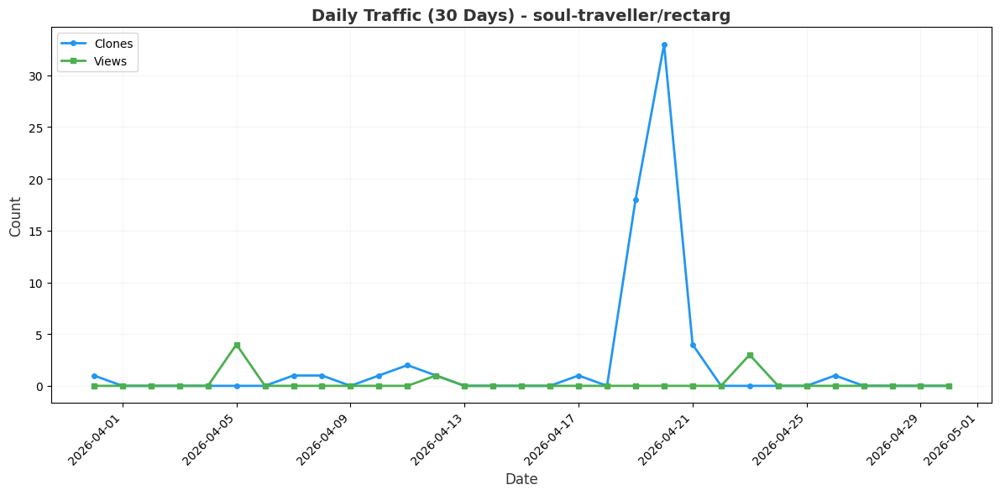

#### Weekly Traffic (12 Weeks)

*Shows weekly aggregated clones and views for the last 12 weeks (~3 months). Useful for identifying medium-term trends and seasonal patterns.*

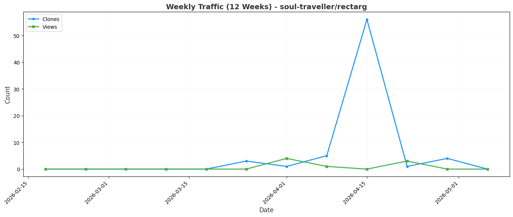

#### Bi-Weekly Traffic (26 Periods)

*Shows bi-weekly aggregated clones and views for the last 26 periods (~1 year). Useful for identifying long-term trends and yearly patterns.*

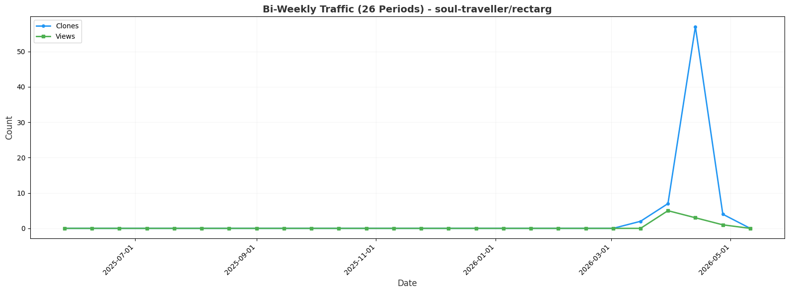

#### Cumulative Traffic (Lifetime)

*Shows running totals of both clones and views over the entire lifetime of tracking. Useful for seeing overall growth and total adoption.*

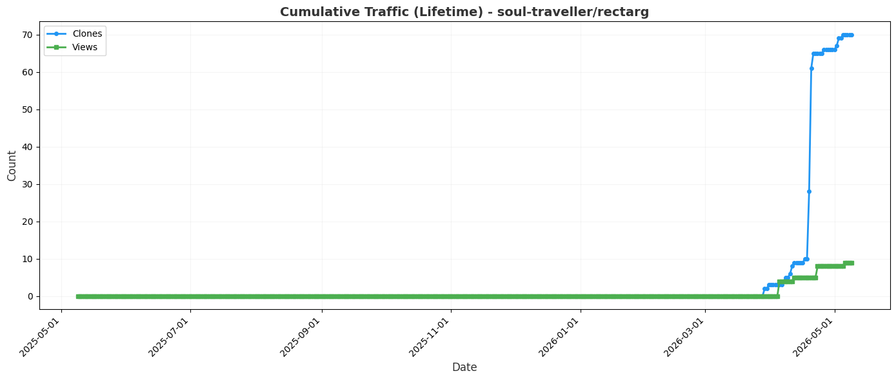

#### Separate Cumulative Graphs

*Individual cumulative graphs for clones and views, allowing for easier comparison between the two metrics.*

**Cumulative Clones:**

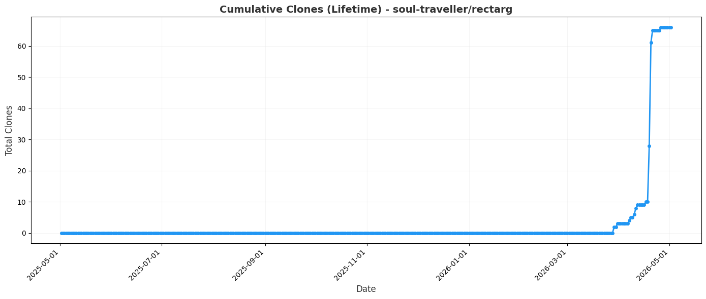

**Cumulative Views:**

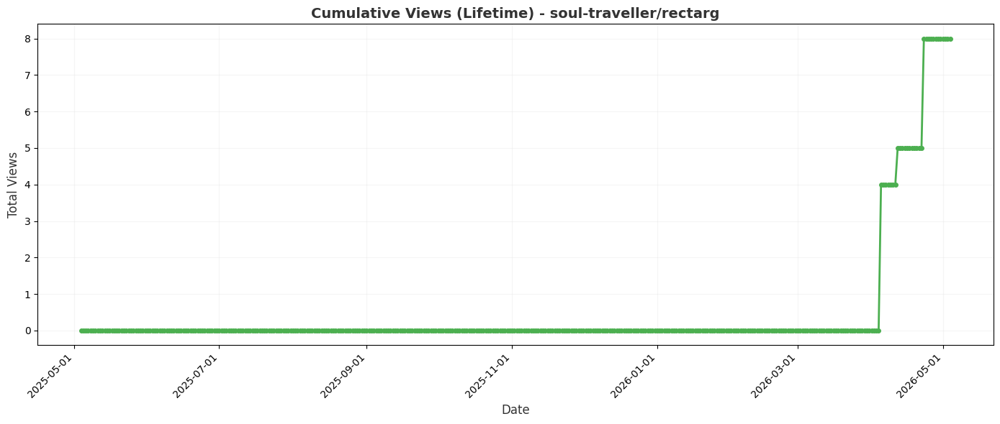

---

# github-traffic-dashboard

### 🗅️ Clones

*Repository clone statistics showing total and unique clones over different time periods.*

| Period | Total | Unique |
|--------|-------|--------|
| Last 30 Days | 1175 | 527 |
| Last 90 Days | 1175 | 527 |
| Lifetime | 1175 | 527 |

### 📄 Repeat vs New Clones

*Analysis of repository adoption showing repeat clones vs new unique clones.*

*Note: GitHub API does not provide geographical location data for cloners.*

| Period | Total Clones | Unique Clones | Repeat Clones | Repeat % |
|--------|--------------|----------------|----------------|----------|
| Last 30 Days | 1175 | 527 | 648 | 55.1% |
| Last 90 Days | 1175 | 527 | 648 | 55.1% |
| Lifetime | 1175 | 527 | 648 | 55.1% |

### 👀 Views

*Repository view statistics showing total and unique views over different time periods.*

| Period | Total | Unique |
|--------|-------|--------|
| Last 30 Days | 279 | 19 |
| Last 90 Days | 279 | 19 |
| Lifetime | 279 | 19 |

### 📞 Referrers

*Top referrer sources driving traffic to this repository.*

**Total Unique Referrers:** 2

| Referrer | Total Views | Unique Visitors |
|----------|-------------|----------------|
| soul-traveller.github.io | 7 | 3 |
| github.com | 4 | 1 |

### 👥 Repeat vs New Visitors

*Analysis of visitor engagement showing repeat visitors vs new unique visitors.*

*Note: GitHub API does not provide geographical location data for visitors.*

| Period | Total Views | Unique Visitors | Repeat Visitors | Repeat % |
|--------|-------------|-----------------|-----------------|----------|
| Last 30 Days | 279 | 19 | 260 | 93.2% |
| Last 90 Days | 279 | 19 | 260 | 93.2% |
| Lifetime | 279 | 19 | 260 | 93.2% |

### 📈 Traffic Graphs

*Visual representations of traffic trends over different time periods.*

#### Daily Traffic (30 Days)

*Shows daily clones and views trends for the last 30 days. Useful for identifying short-term patterns and recent activity spikes.*

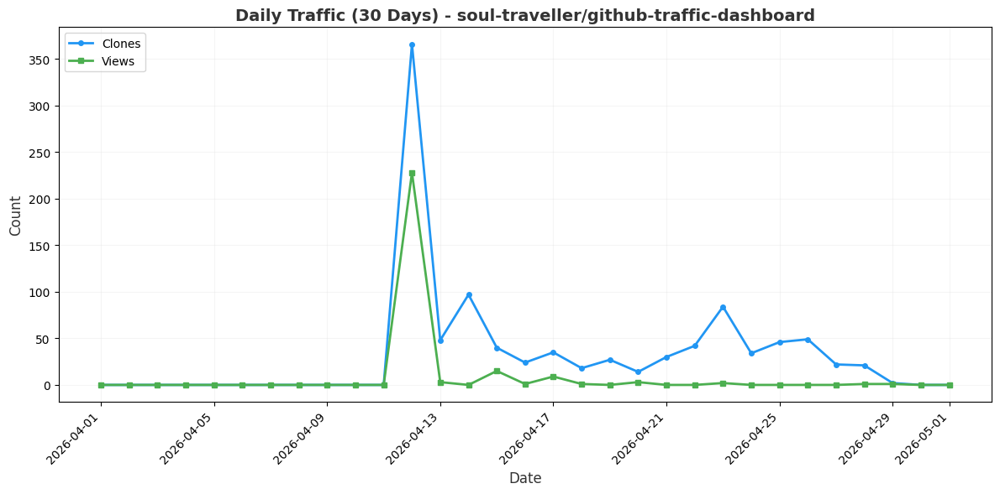

#### Weekly Traffic (12 Weeks)

*Shows weekly aggregated clones and views for the last 12 weeks (~3 months). Useful for identifying medium-term trends and seasonal patterns.*

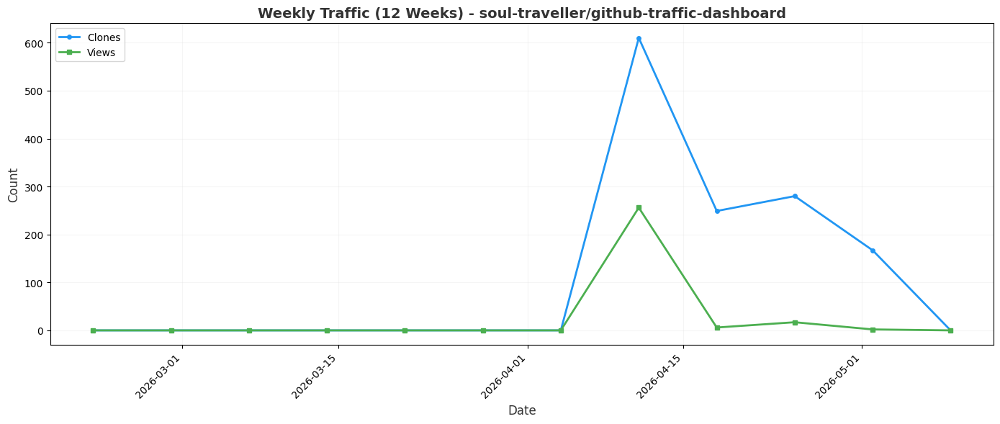

#### Bi-Weekly Traffic (26 Periods)

*Shows bi-weekly aggregated clones and views for the last 26 periods (~1 year). Useful for identifying long-term trends and yearly patterns.*

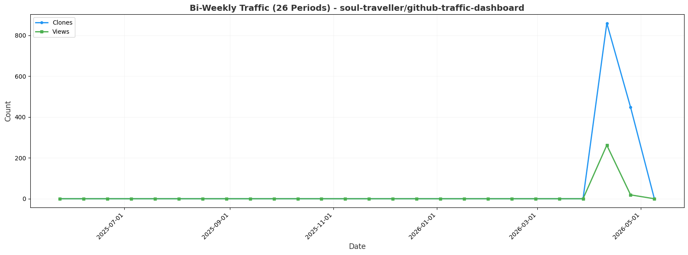

#### Cumulative Traffic (Lifetime)

*Shows running totals of both clones and views over the entire lifetime of tracking. Useful for seeing overall growth and total adoption.*

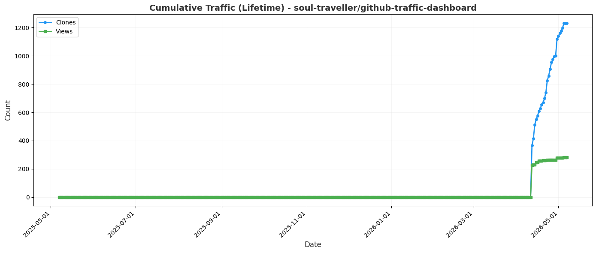

#### Separate Cumulative Graphs

*Individual cumulative graphs for clones and views, allowing for easier comparison between the two metrics.*

**Cumulative Clones:**

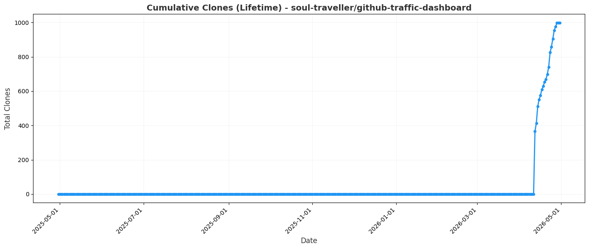

**Cumulative Views:**

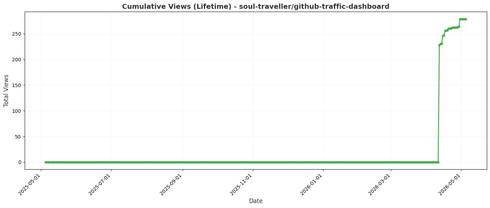

---

# average_ti3s_rgbgeom

### 🗅️ Clones

*Repository clone statistics showing total and unique clones over different time periods.*

| Period | Total | Unique |
|--------|-------|--------|
| Last 30 Days | 12 | 12 |
| Last 90 Days | 12 | 12 |
| Lifetime | 12 | 12 |

### 📄 Repeat vs New Clones

*Analysis of repository adoption showing repeat clones vs new unique clones.*

*Note: GitHub API does not provide geographical location data for cloners.*

| Period | Total Clones | Unique Clones | Repeat Clones | Repeat % |
|--------|--------------|----------------|----------------|----------|
| Last 30 Days | 12 | 12 | 0 | 0.0% |
| Last 90 Days | 12 | 12 | 0 | 0.0% |
| Lifetime | 12 | 12 | 0 | 0.0% |

### 👀 Views

*Repository view statistics showing total and unique views over different time periods.*

| Period | Total | Unique |
|--------|-------|--------|
| Last 30 Days | 0 | 0 |
| Last 90 Days | 0 | 0 |
| Lifetime | 0 | 0 |

### 📞 Referrers

*Top referrer sources driving traffic to this repository.*

**Total Unique Referrers:** 0

*No referrer data available.*

### 👥 Repeat vs New Visitors

*Analysis of visitor engagement showing repeat visitors vs new unique visitors.*

*Note: GitHub API does not provide geographical location data for visitors.*

| Period | Total Views | Unique Visitors | Repeat Visitors | Repeat % |
|--------|-------------|-----------------|-----------------|----------|
| Last 30 Days | 0 | 0 | 0 | 0% |
| Last 90 Days | 0 | 0 | 0 | 0% |
| Lifetime | 0 | 0 | 0 | 0% |

### 📈 Traffic Graphs

*Visual representations of traffic trends over different time periods.*

#### Daily Traffic (30 Days)

*Shows daily clones and views trends for the last 30 days. Useful for identifying short-term patterns and recent activity spikes.*

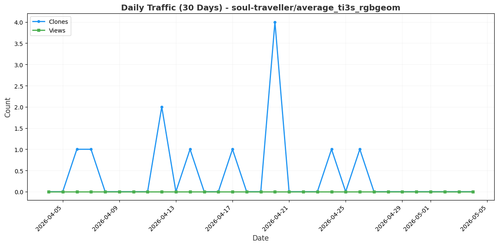

#### Weekly Traffic (12 Weeks)

*Shows weekly aggregated clones and views for the last 12 weeks (~3 months). Useful for identifying medium-term trends and seasonal patterns.*

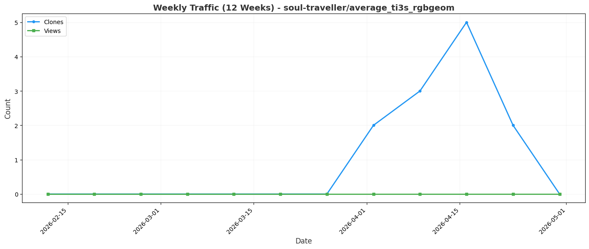

#### Bi-Weekly Traffic (26 Periods)

*Shows bi-weekly aggregated clones and views for the last 26 periods (~1 year). Useful for identifying long-term trends and yearly patterns.*

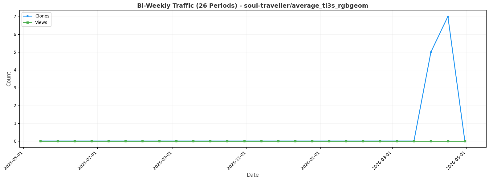

#### Cumulative Traffic (Lifetime)

*Shows running totals of both clones and views over the entire lifetime of tracking. Useful for seeing overall growth and total adoption.*

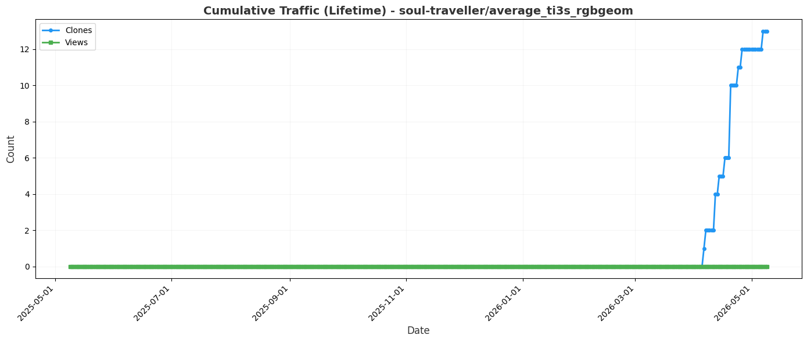

#### Separate Cumulative Graphs

*Individual cumulative graphs for clones and views, allowing for easier comparison between the two metrics.*

**Cumulative Clones:**

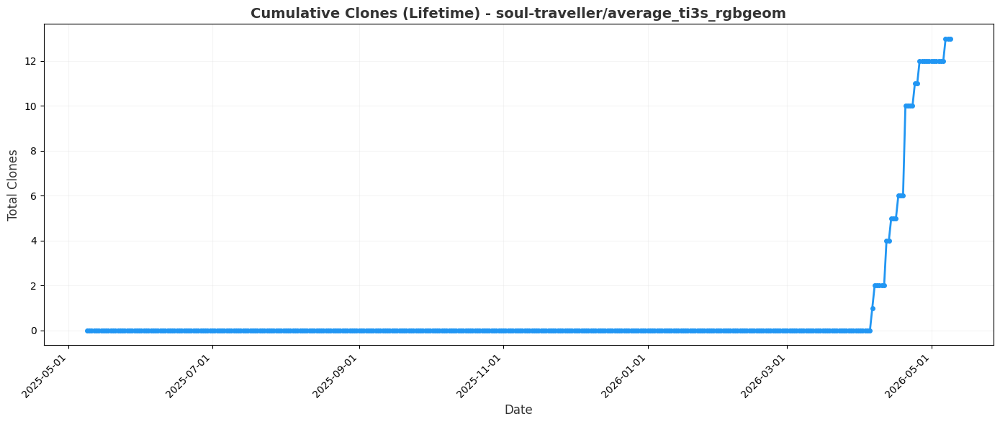

**Cumulative Views:**

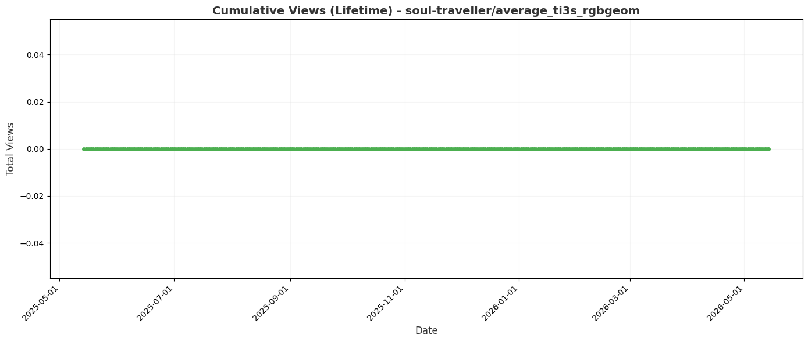

---

# read_image_patch_colors

### 🗅️ Clones

*Repository clone statistics showing total and unique clones over different time periods.*

| Period | Total | Unique |
|--------|-------|--------|
| Last 30 Days | 38 | 37 |
| Last 90 Days | 40 | 39 |
| Lifetime | 40 | 39 |

### 📄 Repeat vs New Clones

*Analysis of repository adoption showing repeat clones vs new unique clones.*

*Note: GitHub API does not provide geographical location data for cloners.*

| Period | Total Clones | Unique Clones | Repeat Clones | Repeat % |
|--------|--------------|----------------|----------------|----------|
| Last 30 Days | 38 | 37 | 1 | 2.6% |
| Last 90 Days | 40 | 39 | 1 | 2.5% |
| Lifetime | 40 | 39 | 1 | 2.5% |

### 👀 Views

*Repository view statistics showing total and unique views over different time periods.*

| Period | Total | Unique |
|--------|-------|--------|
| Last 30 Days | 2 | 2 |
| Last 90 Days | 2 | 2 |
| Lifetime | 2 | 2 |

### 📞 Referrers

*Top referrer sources driving traffic to this repository.*

**Total Unique Referrers:** 1

| Referrer | Total Views | Unique Visitors |
|----------|-------------|----------------|
| github.com | 2 | 2 |

### 👥 Repeat vs New Visitors

*Analysis of visitor engagement showing repeat visitors vs new unique visitors.*

*Note: GitHub API does not provide geographical location data for visitors.*

| Period | Total Views | Unique Visitors | Repeat Visitors | Repeat % |
|--------|-------------|-----------------|-----------------|----------|
| Last 30 Days | 2 | 2 | 0 | 0.0% |
| Last 90 Days | 2 | 2 | 0 | 0.0% |
| Lifetime | 2 | 2 | 0 | 0.0% |

### 📈 Traffic Graphs

*Visual representations of traffic trends over different time periods.*

#### Daily Traffic (30 Days)

*Shows daily clones and views trends for the last 30 days. Useful for identifying short-term patterns and recent activity spikes.*

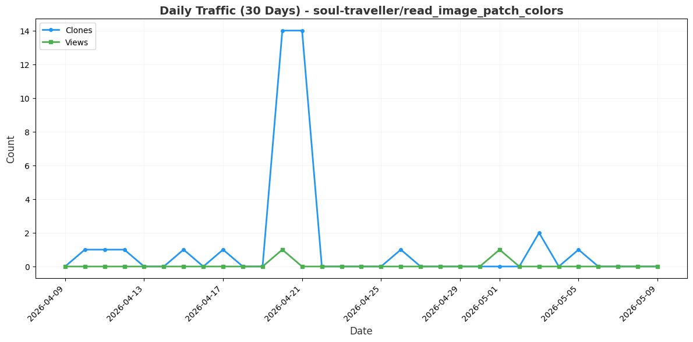

#### Weekly Traffic (12 Weeks)

*Shows weekly aggregated clones and views for the last 12 weeks (~3 months). Useful for identifying medium-term trends and seasonal patterns.*

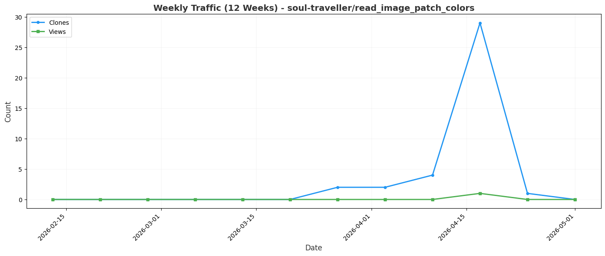

#### Bi-Weekly Traffic (26 Periods)

*Shows bi-weekly aggregated clones and views for the last 26 periods (~1 year). Useful for identifying long-term trends and yearly patterns.*

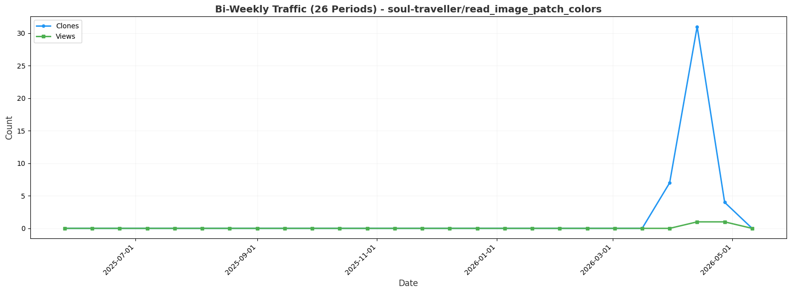

#### Cumulative Traffic (Lifetime)

*Shows running totals of both clones and views over the entire lifetime of tracking. Useful for seeing overall growth and total adoption.*

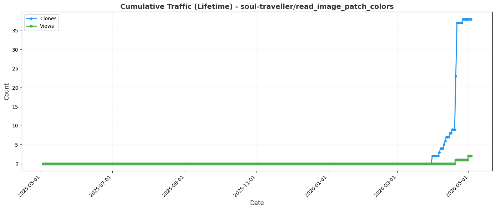

#### Separate Cumulative Graphs

*Individual cumulative graphs for clones and views, allowing for easier comparison between the two metrics.*

**Cumulative Clones:**

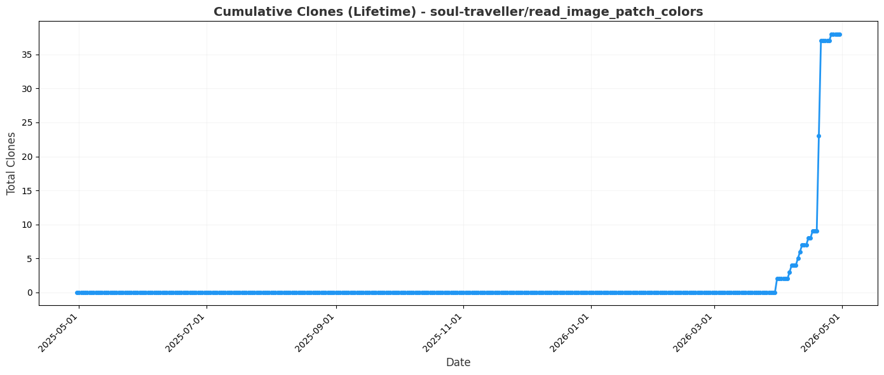

**Cumulative Views:**

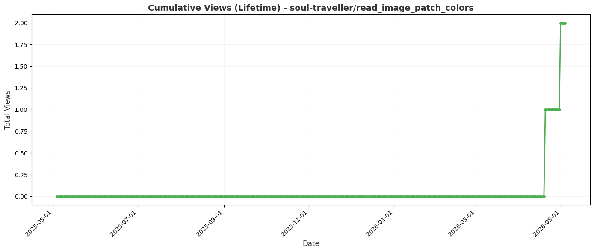

---

*This dashboard is automatically updated daily using GitHub Actions.*
