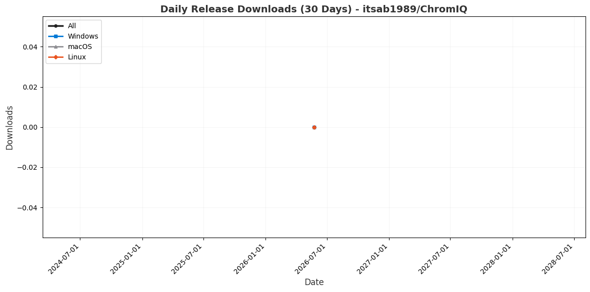
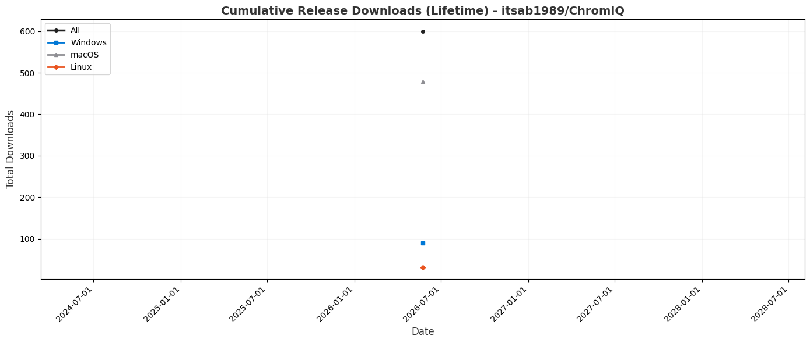

See full Reference and Usage Guide at:
https://soul-traveller.github.io/github-traffic-dashboard/

# 📊 GitHub Traffic Dashboard

This dashboard tracks historical traffic data (clones, views, and release downloads) for GitHub repositories.

**Last Updated:** 2026-05-24T18:12:27.660360Z

## 📋 How Metrics Are Calculated

This dashboard uses GitHub Traffic API data to calculate the following metrics:

### 📊 Core Metrics

**Views:**
- Counted when someone visits the repository page
- Includes page views from web browsers
- Does not include visits via command-line tools or APIs

**Clones:**
- Counted when someone clones the repository
- Includes clones via `git clone`, GitHub Desktop, download ZIP, and API
- Can occur without a corresponding view event

**Release Downloads:**
- Counted when someone downloads a pre-compiled release asset (binary/installer)
- Split by platform from the asset file name (Windows, macOS, Linux); **All** is the combined total
- This is a **separate metric** from Clones - cloning the source is not a release download
- **Lifetime** totals reflect all-time downloads (GitHub's cumulative `download_count`) and are accurate immediately
- **Per-day** figures are derived by diffing daily snapshots, so they only accrue from the first tracked day onward

**Important:** Views and Clones are **independent metrics**. Users can:
- View without cloning
- Clone without viewing (e.g., via `git clone` command)
- Both view and clone

### 🔢 Calculation Formulas

**For any time period (short-term, medium-term, lifetime):**

**Total Metrics:**
- Total Views = Sum of daily views for the period
- Total Clones = Sum of daily clones for the period

**Unique Metrics:**
- Unique Views = Sum of daily unique views for the period
- Unique Clones = Sum of daily unique clones for the period
  - Note: This sums daily unique counts, which may count the same user on multiple days

**Repeat Metrics:**
- Repeat Views = Total Views - Unique Views
- Repeat Clones = Total Clones - Unique Clones
- Repeat Percentage = (Repeat / Total) × 100

**Example:**
```
If a repository has:
- Total Views: 100
- Unique Views: 20
Then:
- Repeat Views = 100 - 20 = 80
- Repeat Percentage = (80 / 100) × 100 = 80%
```

### 📈 Graph Data Aggregation

**Daily Graphs:**
- Shows raw daily data points
- Each point represents one day's activity

**Weekly Graphs:**
- Aggregates daily data into 7-day periods
- Each point represents the sum of 7 consecutive days

**Bi-Weekly Graphs:**
- Aggregates daily data into 14-day periods
- Each point represents the sum of 14 consecutive days

**Cumulative Graphs:**
- Shows running totals over time
- Each point represents the sum of all previous days plus current day

## 📋 Table of Contents

Quick navigation to repository statistics:

- [ChromIQ](#chromiq)

# ChromIQ

### 🗅️ Clones

*Repository clone statistics showing total and unique clones over different time periods.*

| Period | Total | Unique |
|--------|-------|--------|
| Last 30 Days | 5718 | 1221 |
| Last 90 Days | 5718 | 1221 |
| Lifetime | 5718 | 1221 |

### 📄 Repeat vs New Clones

*Analysis of repository adoption showing repeat clones vs new unique clones.*

*Note: GitHub API does not provide geographical location data for cloners.*

| Period | Total Clones | Unique Clones | Repeat Clones | Repeat % |
|--------|--------------|----------------|----------------|----------|
| Last 30 Days | 5718 | 1221 | 4497 | 78.6% |
| Last 90 Days | 5718 | 1221 | 4497 | 78.6% |
| Lifetime | 5718 | 1221 | 4497 | 78.6% |

### 👀 Views

*Repository view statistics showing total and unique views over different time periods.*

| Period | Total | Unique |
|--------|-------|--------|
| Last 30 Days | 708 | 226 |
| Last 90 Days | 708 | 226 |
| Lifetime | 708 | 226 |

### 📞 Referrers

*Top referrer sources driving traffic to this repository.*

**Total Unique Referrers:** 10

| Referrer | Total Views | Unique Visitors |
|----------|-------------|----------------|
| github.com | 51 | 12 |
| dpreview.com | 28 | 11 |
| forum.luminous-landscape.com | 25 | 7 |
| Google | 15 | 8 |
| printerknowledge.com | 14 | 8 |
| reddit.com | 11 | 10 |
| hub.displaycal.net | 11 | 2 |
| freelists.org | 4 | 1 |
| Bing | 3 | 2 |
| com.reddit.frontpage | 2 | 2 |

### 👥 Repeat vs New Visitors

*Analysis of visitor engagement showing repeat visitors vs new unique visitors.*

*Note: GitHub API does not provide geographical location data for visitors.*

| Period | Total Views | Unique Visitors | Repeat Visitors | Repeat % |
|--------|-------------|-----------------|-----------------|----------|
| Last 30 Days | 708 | 226 | 482 | 68.1% |
| Last 90 Days | 708 | 226 | 482 | 68.1% |
| Lifetime | 708 | 226 | 482 | 68.1% |

### 📥 Release Downloads

*Pre-compiled release-asset downloads, split by platform. This is separate from clones.*

*Lifetime totals reflect all-time downloads (GitHub's cumulative counter). Per-day figures (Last 30/90 Days) are derived from daily snapshots and only accrue from the first tracked day onward.*

| Platform | Last 30 Days | Last 90 Days | Lifetime |
|----------|-----------|-----------|----------|
| 🪟 Windows | 0 | 0 | 90 |
| 🍎 macOS | 0 | 0 | 479 |
| 🐧 Linux | 0 | 0 | 31 |
| **All** | **0** | **0** | **600** |

🆕 **Latest Release:** `v3.7.38` - **0** downloads (published 2026-05-24)

**By Architecture (lifetime):**

*Lifetime downloads split by CPU architecture - useful for deciding which builds are still worth shipping.*

| Platform | arm64 | x86_64 | universal | Total |
|----------|-------|-------|-------|-------|
| 🪟 Windows | 22 | 68 | 0 | **90** |
| 🍎 macOS | 305 | 124 | 50 | **479** |
| 🐧 Linux | 8 | 23 | 0 | **31** |

**Top 10 Releases by Downloads (lifetime):**

| Release | Downloads | Published |
|---------|-----------|-----------|
| v3.6.4 | 54 | 2026-05-17 |
| v3.6.5 | 48 | 2026-05-18 |
| v3.6.7 | 46 | 2026-05-18 |
| v3.7.0 | 41 | 2026-05-18 |
| v3.7.1 | 40 | 2026-05-18 |
| v3.6.6 | 38 | 2026-05-18 |
| v3.0.0-beta.10 | 18 | 2026-05-08 |
| v3.6.0 | 13 | 2026-05-17 |
| v2.2.3 | 10 | 2026-05-03 |
| v3.7.5 | 9 | 2026-05-19 |

#### Daily Release Downloads (30 Days)

*Per-day downloads for the last 30 days, by platform. Useful for spotting download spikes after new releases.*



#### Cumulative Release Downloads (Lifetime)

*All-time running download totals by platform. Useful for seeing overall adoption per platform.*



### 📈 Traffic Graphs

*Visual representations of traffic trends over different time periods.*

#### Daily Traffic (30 Days)

*Shows daily clones and views trends for the last 30 days. Useful for identifying short-term patterns and recent activity spikes.*


#### Weekly Traffic (12 Weeks)

*Shows weekly aggregated clones and views for the last 12 weeks (~3 months). Useful for identifying medium-term trends and seasonal patterns.*


#### Bi-Weekly Traffic (26 Periods)

*Shows bi-weekly aggregated clones and views for the last 26 periods (~1 year). Useful for identifying long-term trends and yearly patterns.*


#### Cumulative Traffic (Lifetime)

*Shows running totals of both clones and views over the entire lifetime of tracking. Useful for seeing overall growth and total adoption.*


#### Separate Cumulative Graphs

*Individual cumulative graphs for clones and views, allowing for easier comparison between the two metrics.*

**Cumulative Clones:**


**Cumulative Views:**


---

*This dashboard is automatically updated daily using GitHub Actions.*
